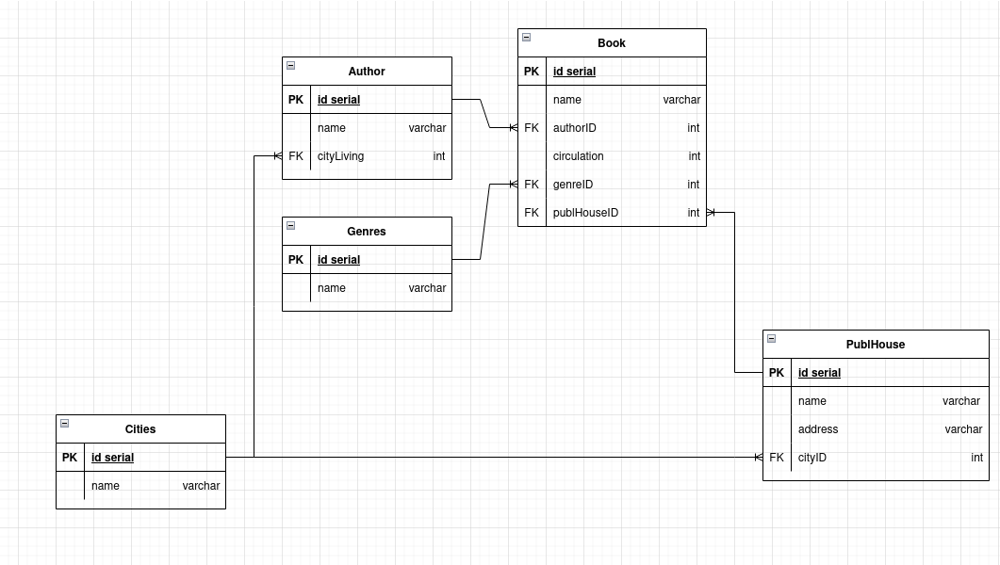

# ЛР 1. Вариант 4


## Задание

> Создать и заполнить базу данных для обработки данных по работе книжной лавки,
> состоящую из четырех таблиц. Первая таблица должна содержать поля:
> идентификатор жанра, наименование жанра и другие поля при необходимости.
> Вторая: идентификатор книги, название книги, автор книги, тираж,
> идентификатор жанра книги, идентификатор издательства, идентификатор города
> проживания автора и другие поля при необходимости. Третья: идентификатор
> издательства, наименование издателя, адрес издательства и другие поля при
> необходимости. Четвертая: справочник городов. На основании созданных таблиц
> создать таблицу, содержащую, например, поля: название книги, автор книги,
> город проживания автора, жанр, издательство.

## Связи



## Гайд

ЕСЛИ ПОЛЬЗУЕМСЯ ВООБЩЕ ПЕРВЫЙ РАЗ
1. ``` $ sudo su - postgres ```  
    1. ``` $ initdb --locale en_US.UTF-8 -D /var/lib/postgres/data ```  

1. Создаем ручками бд
    1. ``` $ sudo -su postgres ```
    2. ``` # createdb labs_db ```
    3. ``` # exit ```
2. Из этой папки последовательно выполняем команды:  
    1. ``` $ make part1 ```
    2. ``` $ make part2 ```
    3. ``` $ make part3 ```
    3. ``` $ make part4 ```
    > Каждая команда выполняет части создания/заполнения/измения/объединения
    > соответственно
    4. Если хотите создать всё быстро - ``` $ make all ```
3. Для просмотра БД:
    1. ``` sudo -su postgres ```
    2. ``` psql ```
    3. ``` \c labs_db ```
    4. ``` SELECT * FROM l1_v4.info; ```
    